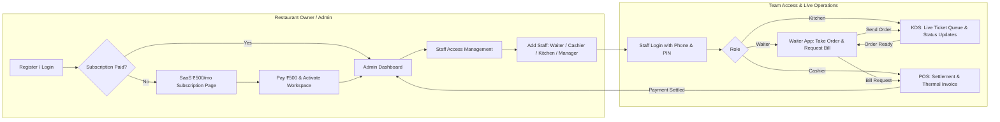

# Walkthrough - SaaS Restaurant Management System (Multi-Role & Sync)

We have completed both **Step 1 (SaaS Subscription & Staff Access Delegation)** and **Step 2 (Real-Time Multi-Role Order & Kitchen-POS Sync)**.

---

## 1. Step 1: SaaS Subscription & Staff Access Control

- **SaaS Subscription Page (`subscription_screen.dart`)**:
  - Displays the **₹500 / month Pro Restaurant Plan**.
  - Includes UPI/QR, Card, and Net Banking payment options.
  - Automatically redirects unpaid Restaurant Owners to `/subscription`.
- **High-Security Auth Guard (`app_router.dart` & `customer_auth_session.dart`)**:
  - Validates active subscription status for Restaurant Owners.
  - Allows created staff accounts (Waiters, Cashiers, Kitchen Staff) to log in using their credentials (Phone + PIN).
  - Validates staff account status (`Active` vs `Disabled`). If disabled by Admin, shows security message: *"Access Denied: Your staff account has been deactivated by the Restaurant Owner."*
- **Staff Delegation UI (`staff_management_screen.dart` & `add_staff_dialog.dart`)**:
  - Owner can add, edit, disable, or delete staff credentials with custom roles (`Manager`, `Waiter`, `Cashier`, `Kitchen`) and shifts (`Morning`, `Evening`, `Night`, `Full Day`).

---

## 2. Step 2: Multi-Role Real-Time Order & Kitchen-POS Sync

- **Centralized Live Order Manager (`LocalStorage`)**:
  - `getActiveOrders()`, `createLiveOrder()`, `updateLiveOrderStatus()`, and `settleOrderPayment()`.
- **Waiter App (`waiter_dashboard_screen.dart`)**:
  - Real-time floor map & table status tracking.
  - Take order with custom item notes $\rightarrow$ Sends live ticket to Kitchen (KDS).
- **Kitchen Display System (`kitchen_dashboard_screen.dart`)**:
  - Real-time order queue with status transitions (`Pending` $\rightarrow$ `Preparing` $\rightarrow$ `Ready` $\rightarrow$ `Completed`).
- **Cashier / POS (`pos_dashboard_screen.dart`)**:
  - Processes counter & table bill settlements with instant payment confirmation (Cash, Card, UPI) and auto-clears table status.

---

## Complete Multi-Role System Architecture

